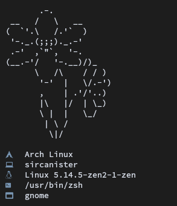
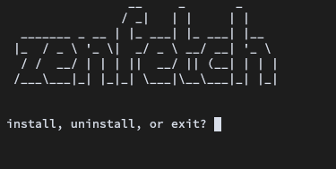

<h1 align="center">zenfetch</h1>

  <b>Small fetch script written in python that is forked from KatHamer's tinyfetch. Only supports GNU/Linux at the moment.<b>

## Installation
    $ git clone https://github.com/nix-connoisseur/zenfetch.git
    $ cd zenfetch
    $ ./setup.py (or run "sudo ln -s /path/to/zenfetch/main.py /usr/bin/zenfetch")

  

## Dependencies
* [wmctrl-python3](https://pypi.org/project/wmctrl-python3/) (should be installed when using setup.py)

## Usage
It should run with
  
    $ zenfetch

